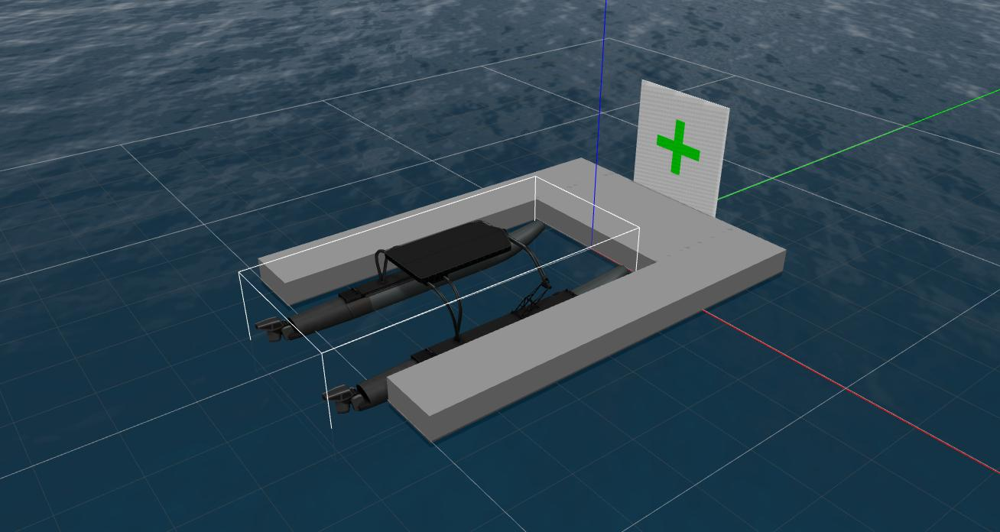

# Robotx_gazebo

Simulation package for the Robotx challenge

General use explained on upper-level `README.md`

## Vehicles dynamics

In the `urdf` folder are located the configuration urdf files for : 
- the buyancy and waves
- the thrusters
- the wind

relative to each robot.

## Models

### Docking station

`robotx_docking`

Basic docking station to test image recognition and decision process.

Currently with a green cross

